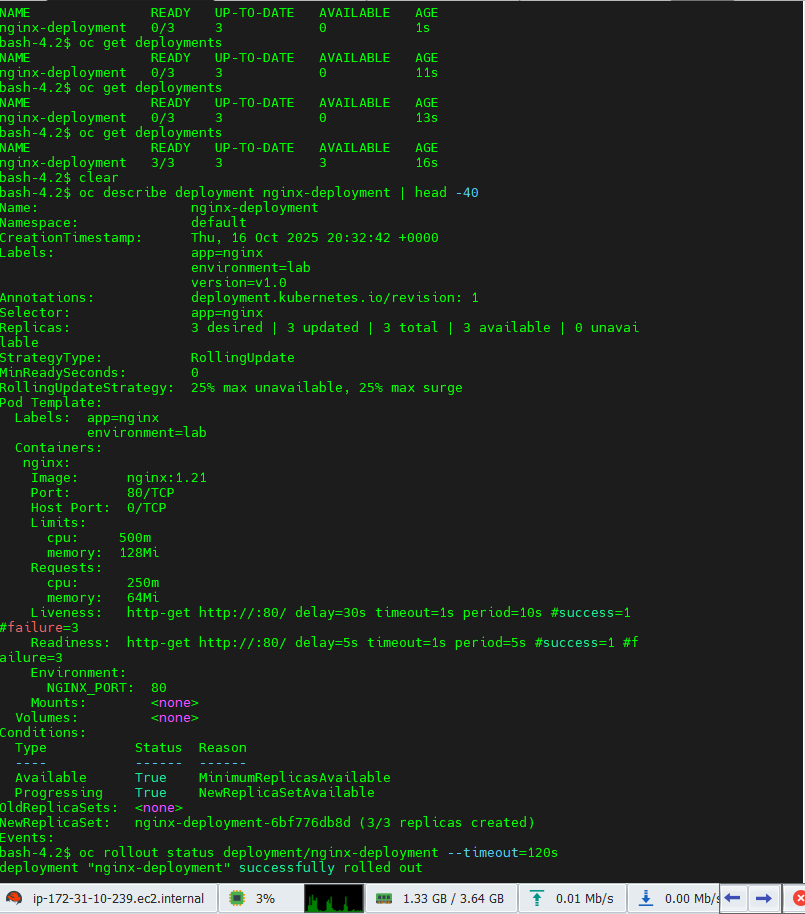
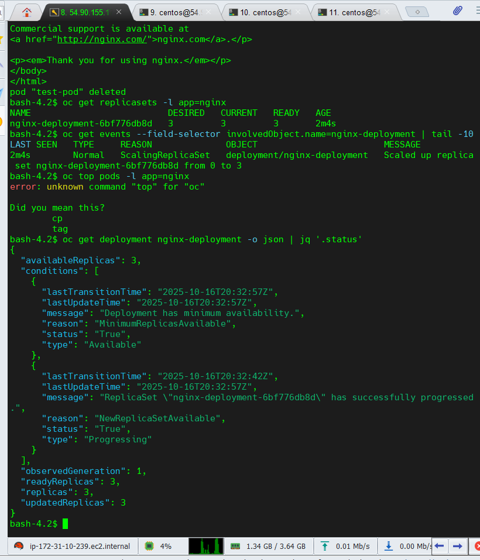

# Lab 02 – Understanding Resource Manifests

## 🎯 Objectives
- Understand YAML manifest structure
- Create and validate Deployment manifests
- Apply manifests using `kubectl`/`oc`
- Inspect rollout and analyze logs
- Link manifests with real-world OpenShift operations

---

## 🧩 Practical Insights & Real‑World Usage
Declarative manifests like this form the **core of GitOps pipelines** using Jenkins, ArgoCD, or Tekton.
They define the desired application state and ensure reproducibility from **Dev → QA → Prod**.

Manifests enable:
- Rollback-safe updates (`oc rollout undo`)
- Policy enforcement via OPA/Gatekeeper
- Version-controlled IaC via Git

💡 *Tip:* “Manifests are infrastructure code—treat them like software.”

---

## 🧹 Cleanup Commands
```bash
oc delete deployment nginx-deployment
rm -rf ~/lab2-manifests
```

## 📸 Screenshots
| Step | Proof |
|------|-------|
| Deployment Created |  |
| Rollout Status |  |
| HTML Output |  |
| JSON Status |  |
